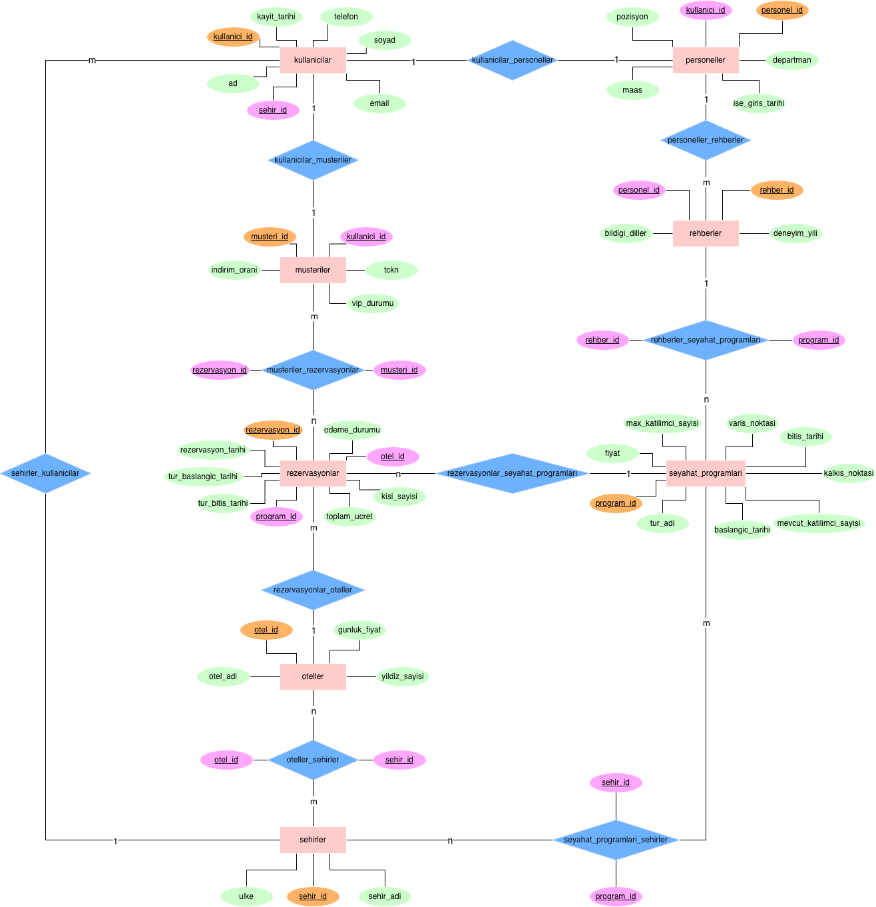

# Turizm Acentesi Yönetim Sistemi Veri Tabanı Tasarımı

## 📌 Proje Özeti
Bir turizm acentesinin müşteri rezervasyonları, tur programları, rehber atamaları ve otel konaklama süreçlerini düzenlemek için tasarladığımız kapsamlı bir ilişkisel veri tabanı projesidir. Sistemdeki veri bütünlüğü ve otomatik işlemler tamamen SQL seviyesinde çözülmüştür.

## 🚀 Kullanılan Teknolojiler
* **Veri Tabanı:** MySQL 8.0
* **Yönetim Araçları:** phpMyAdmin, cPanel
* **Tasarım:** draw.io (ER Diyagramı)
* **SQL Komutları:** DDL, DML, DQL

## ⚙️ Teknik Özellikler
* **Tablo Yapısı:** 8 ana tablo ve çoka-çok (N:M) ilişkileri bağlayan 4 birleştirme tablosu olmak üzere toplam 12 tablo.
* **Veri Bütünlüğü:** 3NF kurallarına uygun tasarım. Tüm tablolarda Foreign Key, UNIQUE ve CHECK kısıtlamaları (constraints) kullanıldı.
* **Aktif 5 Adet Trigger:** Rezervasyon iptal/ekleme durumunda kontenjanın otomatik güncellenmesi, kapasite kontrolü, VIP müşterilere otomatik indirim uygulanması gibi işlemler için.
* **12 Adet Stored Procedure:** Belirli fiyat aralığındaki turları bulma, VIP müşterileri listeleme gibi raporlama ve karmaşık `JOIN` işlemlerini hızlandırmak için yazılmış saklı yordamlar.

## 📸 ER Diyagramı
Projenin ilişkisel şeması ve tablo yapıları aşağıdaki diyagramda modellenmiştir:

## 🤝 Katkıda Bulunanlar
Bu proje iki kişilik bir ekip çalışmasıdır:
* **Arda Uygur & Arda Can Gani:** Veri tabanı ER diyagramının tasarlanması, tabloların oluşturulması, DDL/DML/DQL sorguları ile Trigger ve Stored Procedure'lerin yazımı baştan sona ortak yürütülmüştür.
